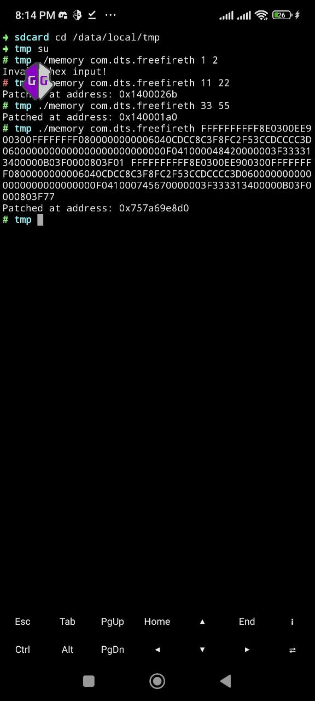
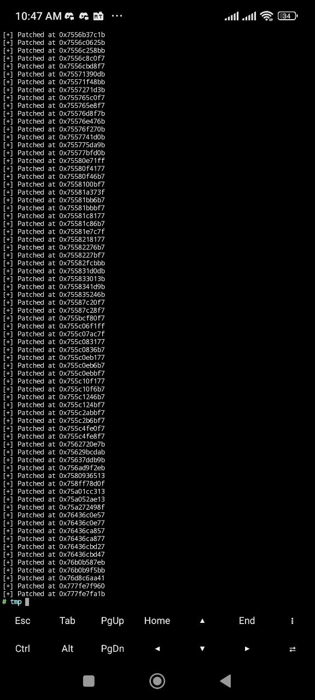

# AOBMemoryTools

**AOB Memory Debugger** is an Android tool designed to search or replace Byte pattern in Memory External || Internal Working...!

## How It Works

AOB Pattern Searching Android  utilizes the patching logic from the following open-source repositories:

- [Memory Debug Logic](https://github.com/oobbb/Android-MemoryDebug-Tools)
- [AOB Logic ](https://github.com/iiduka-researches/202307-memoryless)


# AOB Search/Replace Fast Build Project (JNI - Android)

This project allows you to perform AOB (Array of Bytes) search and replace directly on Android using AIDE (Android IDE). Everything runs natively — no PC required.

---

## ✅ Requirements

- Android device
- AIDE installed
- Termux (for running binary)
- Basic C/C++ knowledge

---

## 📁 Project Structure

After building with AIDE, the following folders will be created:

- `/jni/` → C/C++ source code
- `/obj/local/armeabi-v7a/` → Compiled output (your executable file will be here)

---


## AOB Example 

Aob Search Or Replace..!!  How to Run In Terminal?? 

**Fast Build Project Android AIDE**
```
cd /data/local/tmp
```
```
su
```
```
./memory com.dts.freefireth "73 6C 20 35 00 00 80 3F" "73 6C 20 35 9A 19 7A 43"
```

## Screenshots
| AOB Replace                                                                 | Core Chunks                                                                    |
| ---------------------------------------------------------------------------- | --------------------------------------------------------------------------- |
|  |  |

## License

This project is licensed under the [Apache License 2.0](LICENSE).

You are free to use, modify, and distribute this software under the terms of the Apache License.  
See the full license for details.

---
